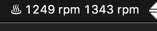

# fan_speed

## What is this?

ファンのスピードを表示する[BitBar](https://getbitbar.com/ "BitBar")のプラグインです。

[Eric Ripa](https://getbitbar.com/contributors/eripa "Eric Ripa")さんが作られていた[Fan Speed](https://getbitbar.com/plugins/System/fan-speed.5s.sh "Fan Speed")というプラグインを使っていたのですが、MacBook Proを新調(2020)したら動かなくなってしまったので自作しました。

(ある時期のモデルからファンの値の型が[変わったらしい](https://github.com/oshi/oshi/issues/925 "Fan speed float parsing on macOS isn't always FPE2")。)

## Notes

- [smcFanControl](https://www.eidac.de/?cat=40 "smcFanControl")に同梱されている`smc`コマンドが必要です。

## LICENSE

MIT
