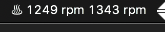

# fan_speed

## What is this?



このプラグインは、Apple Silicon Mac のファン回転数を [BitBar](https://getbitbar.com/) に表示します。

`ismc` コマンドの JSON 出力を直接読み取り、現在のファン速度を `rpm` で表示するようにしています。

## Requirements

- macOS
- Node.js
- `ismc` コマンド
  - `/opt/homebrew/bin/ismc` で実行できる状態である必要があります
  - `ismc` は Apple Silicon Mac 向けの SMC 関連ユーティリティで、[dkorunic/iSMC](https://github.com/dkorunic/iSMC) で提供されています
  - Homebrew でインストールした環境で動作する前提です

## Installation

### iSMC のインストール

[iSMC](https://github.com/dkorunic/iSMC) の README には、Homebrew を使ったインストール手順が記載されています。

```sh
brew tap dkorunic/tap
brew install ismc
```

### fan_speed の配置

1. このリポジトリのスクリプトを BitBar のプラグインディレクトリに配置します。
2. 実行権限を付与します。
   - `chmod +x fan_speed.5s.js`
3. BitBar で表示されることを確認します。

## How it works

- `ismc -o json` の出力から `Fans` セクションを取得します。
- `Fan Count` と `Fan 1 Current Speed` などの値を読み取り、現在のファン速度を表示します。
- 表示形式は BitBar の標準出力形式に合わせています。

## Notes

- Apple Silicon 向けの対応が含まれています。
- `ismc` が見つからない場合や、SMC から値を取得できない場合は `N/A` と表示されます。
- 実際の表示値は Mac の機種・環境によって異なります。

## LICENSE

MIT
